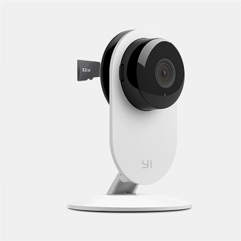

THIS PROJECT IS OUTDATED AND NOT MAINTAINED ANYMORE
===============

# yi-hack-easy
Customized firmware for Yi Home Camera 720p

## Features

* Root access with a configurable password
* Easy network configuration (Static IP / DHCP)
* Crontab enabled; Easy crontab configuration
* No cloud features (cloud and cloudAPI are removed)
* Embedded RTSP server (port 554)
* Telnet server enabled (port 23)
* Embedded HTTP server (port 80) with some cool features at http://[host] (Turn on/off of IR Led/Filter; Ability to restart the camera remotely)
* FTP server enabled (default port 21)
* Updated CURL library (SSL support)
* MicroSD card is **not** required to stay in the camera for the firmware to function

## Installation

1. Format microSD card in FAT32 and copy the content of the repository onto root of the card; 2 files are required and 1 is optional:

    **home** - *required*; this is the modified firmware
    **cam.cfg** - *required*; this is the basic camera configuration
    **crontab.cfg** - *optional*; this file contains the camera crontab

2. Modify **cam.cfg** according to your desired settings (see *Configuration* paragraph)
3. Turn off your camera and insert the microSD card
4. Power on the camera and wait until the firmware is installed

(after installation the camera should be operational; if you remove the microSD card the camera will keep the configurations)    

 ## Configuration
 
 (all configurations are located in *cam.cfg*)
 
 - **ROOT_PASSWORD** - root user password
 - **WIFI_SSID** - SSID of you WiFi network
 - **WIFI_PWD** - password of you WiFI network
 - **DHCP** (yes|no) - you can specify either Static IP address or set DHCP to 'yes' for dynamic host configuration
 - **HOSTNAME** - network hostname of your camera
 - **IP**, **NETMASK**, **GATEWAY**, **NAMESERVER** - configurations for static IP address. **DHCP** need to be 'off'.
 - **LED_WHEN_READY** - final state of the LED when all camera configurations are set
 - **TIMEZONE** - timezone configuration. You can visit [http://svn.fonosfera.org/fon-ng/trunk/luci/modules/admin-fon/root/etc/timezones.db] to see available options
 - **NTP_SERVER** - NTP server configuration
 
